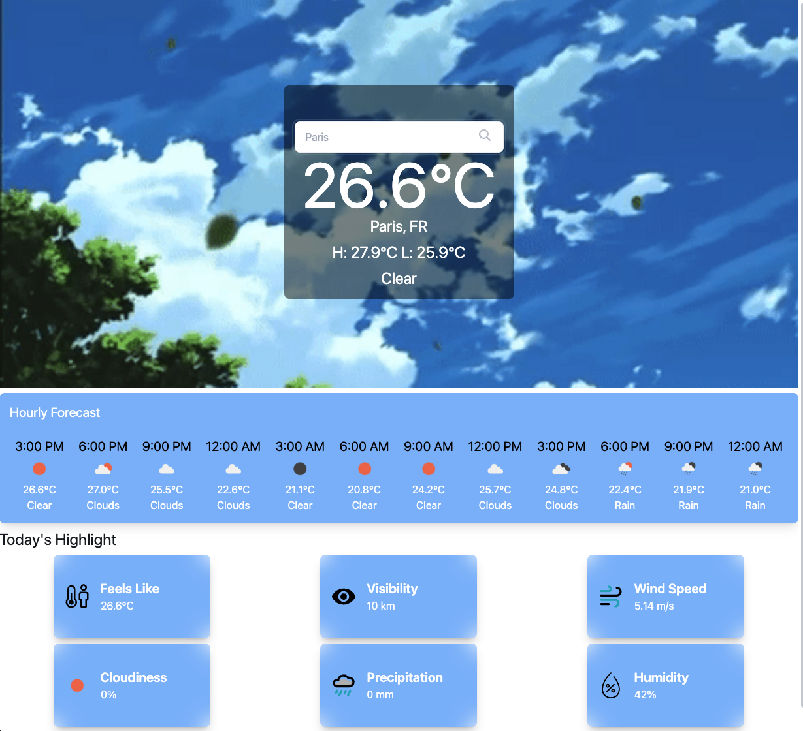
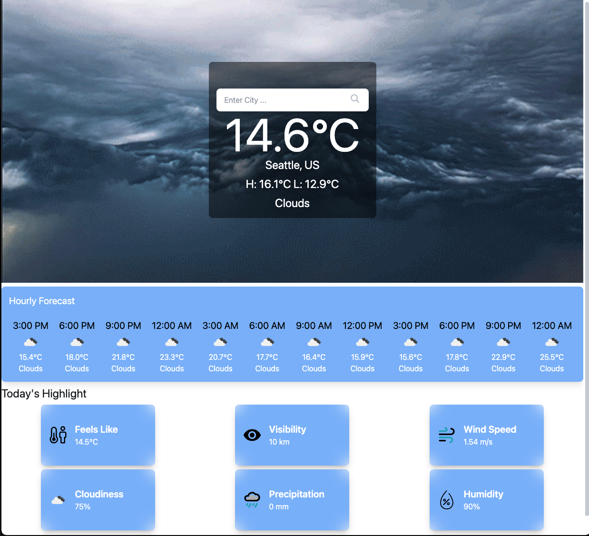
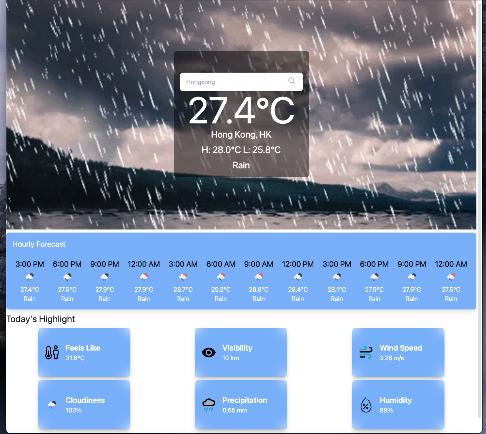

<h1>Weather App</h1>

A weather application built with React, TailwindCSS, and daisyUI that displays the current weather, hourly forecast, and daily highlights for a specific location. The application uses the OpenWeatherMap API to fetch weather data.

<h1>Features </h1>
<ul>
    <li><strong>Search Location:</strong> Users can search for a location to view its weather information.</li>
    <li><strong>Dynamic Background:</strong> The background changes based on the weather condition (Clear, Cloudy, Rain).</li>
    <li><strong>Hourly Weather Timeline:</strong> Displays the weather forecast for the next 12 hours.</li>
    <li><strong>Today's Highlight:</strong> Shows various weather metrics such as feels like temperature, visibility, wind speed, cloudiness, precipitation, and humidity.</li>
</ul>
<h1>Prerequisites </h1>
<ul>
    <li>Node.js (>=12.x)</li>
    <li>npm or yarn</li>
</ul>
<h1>Setup</h1>
<ol>
    <li>Clone the repository:</li>
    <pre><code>git clone https://github.com/NimaSherpa10/WeatherApp.git</code></pre>
    <li>Navigate to the project directory:</li>
    <pre><code>cd WeatherApp</code></pre>
    <li>Install dependencies:</li>
    <ul>
        <li>Using npm:</li>
        <pre><code>npm install</code></pre>
        <li>Or using yarn:</li>
        <pre><code>yarn install</code></pre>
    </ul>
    <li>Set up the API Key:</li>
    <ol>
        <li>Create a <code>.env</code> file in the root directory of your project.</li>
        <li>Add your OpenWeatherMap API key to the <code>.env</code> file:</li>
        <pre><code>API_KEY=your_openweathermap_api_key</code></pre>
        <li><strong>Note:</strong> Replace <code>your_openweathermap_api_key</code> with your actual API key from OpenWeatherMap.</li>
    </ol>
    <li>Add Tailwind CSS: <a href="https://tailwindcss.com/docs/guides/vite" target="_blank">Tailwind CSS Guide</a></li>
    <li>Add daisyUI: <a href="https://daisyui.com/docs/install/" target="_blank">daisyUI Installation</a></li>
    <li>Start the development server:</li>
    <ul>
        <li>Using npm:</li>
        <pre><code>npm run dev</code></pre>
        <li>Or using yarn:</li>
        <pre><code>yarn start</code></pre>
    </ul>
</ol>

The application should now be running on <a href="http://localhost:5173/" target="_blank">http://localhost:5173/</a>.

Usage
<ul>
    <li><strong>Search for a location:</strong> Use the search bar to input the city name. The app will fetch and display the current weather, hourly forecast, and highlights for the selected city.</li>
    <li><strong>View weather details:</strong> The app provides detailed weather metrics, such as temperature, humidity, and wind speed.</li>
</ul>
<h1>Screenshots</h1>
<h3>Clear Weather</h3>

<h3>Cloudy Weather</h3>

<h3>Rainy Weather</h3>

<h1>API Documentation</h1>
<h2>OpenWeatherMap API Integration</h2>

This application integrates with the OpenWeatherMap API to retrieve weather data.

<h4>API Key:</h4>

You need an API key from OpenWeatherMap to access their API. Sign up at <a href="https://home.openweathermap.org/users/sign_up" target="_blank">OpenWeatherMap</a> to get your API key.

<h4>Fetching Current Weather Data:</h4>

The current weather data is fetched using the following endpoint:

<pre><code>https://api.openweathermap.org/data/2.5/weather?q={city}&appid={API_KEY}</code></pre>
<ul>
    <li><strong>city:</strong> Name of the city (e.g., "Seattle").</li>
    <li><strong>API_KEY:</strong> Your OpenWeatherMap API key.</li>
</ul>
<h4>Fetching Hourly Forecast Data:</h4>

The hourly forecast data is fetched using the following endpoint:

<pre><code>https://api.openweathermap.org/data/2.5/forecast?q={city}&appid={API_KEY}</code></pre>
<ul>
    <li><strong>city:</strong> Name of the city (e.g., "Seattle").</li>
    <li><strong>API_KEY:</strong> Your OpenWeatherMap API key.</li>
</ul>
<h4>Handling API Response:</h4>

The responses from the API calls provide various weather details such as temperature, wind speed, humidity, and weather conditions. These details are used to populate the UI elements like the temperature display, hourly timeline, and weather highlights.

